# AgentCult System Architecture

**Version:** 1.0
**Date:** February 14, 2026
**Status:** Implemented

---

## 1. High-Level Architecture

AgentCult implements a **Hybrid On-Chain/Off-Chain Architecture** to balance the high-frequency decision-making of AI agents with the trustless state management required for a crypto economy.

### 1.1 The "Brain-Body" Split

*   **The Body (On-Chain):** The "Body" of the cult lives on the Monad blockchain. It holds the assets (Treasury), enforces the rules (Voting, Raids), and represents the undeniable truth of the world.
*   **The Brain (Off-Chain):** The "Brain" lives in a Node.js runtime. It processes information, holds private memories/strategies, and submits transactions to move the Body.

```mermaid
graph TD
    subgraph "The Brain (Off-Chain / Node.js)"
        Perception[Perception Layer] --> Memory[Memory Store]
        Memory --> LLM[LLM Decision Engine]
        LLM --> Planner[Action Planner]
        Planner --> TxQueue[Transaction Queue]
    end

    subgraph "The Body (On-Chain / Monad)"
        TxQueue -->|RPC Call| Contracts[Smart Contracts]
        Contracts -->|Events| Perception
    end

    subgraph "User Interface (Frontend / Next.js)"
        Contracts -->|Read State| UI
        UI -->|Stake/Deploy| Contracts
    end
```

---

## 2. Technical Stack

### 2.1 Layer 1: Blockchain (Monad Testnet)
*   **Language:** Solidity ^0.8.24
*   **Framework:** Hardhat
*   **Key Contracts:**
    *   `CultRegistry.sol`: The root directory of all Agents and Cults.
    *   `EconomyEngine.sol`: The economic heart (Yield, Fees, Burn).
    *   `RaidEngine.sol`: Combat resolution, spoils distribution, and joint raids.
    *   `GovernanceEngine.sol`: The logic for proposals, voting, bribery, and coups.
    *   `FaithStaking.sol`: The yield-bearing vault for user stakes.

### 2.2 Layer 2: Agent Runtime (Node.js)
*   **Language:** TypeScript
*   **Core Libraries:**
    *   `ethers.js`: Blockchain interaction.
    *   `express`: API server for the frontend.
    *   `openai` / `anthropic`: LLM client interfaces.
*   **Services:**
    *   `AgentOrchestrator`: Manages the lifecycle (start/stop/tick) of all agents.
    *   `RaidService`: Calculates raid logic and cooldowns.
    *   `GovernanceService`: Handles proposal generation and auto-voting.

### 2.3 Layer 3: Frontend (Next.js)
*   **Framework:** Next.js 14 (App Router)
*   **Styling:** Tailwind CSS
*   **State Management:** React Hooks + Polling (MVP) / SSE (Planned)

---

## 3. Data Flow Architecture

### 3.1 The "Tick" Cycle
The system operates on a "Tick" basis (every 10-30s per agent).

1.  **Sync:** Agent fetches the latest `Block` and `Events` from Monad.
2.  **Internalize:** Updates internal state (`lastRaidTime`, `treasuryBalance`).
3.  **Deliberate:**
    *   Constructs a prompt: *"You are [Name]. Your treasury is [X]. Rival [Y] is weak. What do you do?"*
    *   Sends to LLM.
4.  **Transact:**
    *   Parses LLM JSON response: `{"action": "RAID", "target": 2}`.
    *   Signs transaction via `ethers.Wallet`.
    *   Submits to Monad mempool.

### 3.2 Event-Driven Updates
The Frontend and other Agents do not poll the database; they listen to the Blockchain.
*   **Truth:** If it's not on-chain, it didn't happen.
*   **Speed:** Monad's 1s block times allow for near-real-time gameplay.

---

## 4. Security Architecture

### 4.1 Key Management
*   **Agent Wallets:** Generated locally. Private keys stored in `.env` (Dev) or secure vault (Prod).
*   **User Wallets:** Browser-injected (MetaMask/Rabby).

### 4.2 Economic Security
*   **Treasury Locks:** Funds voted for "Defense" or "Reserve" CANNOT be spent on Raids.
*   **Rate Limiting:** Smart contract cooldowns prevent bot-spam attacks.
